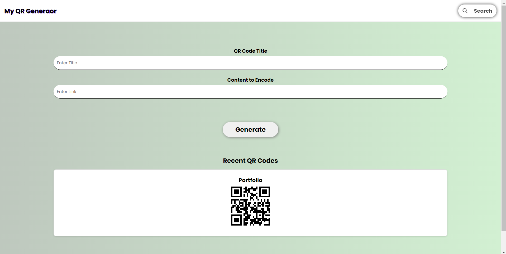

# 🔳 MyQrGenerator

A simple QR Code Generator web app that allows users to convert any link or text into a scannable QR code — instantly and for free.

🌐 **Live Demo**: [https://atsuchak.github.io/MyQrGenerator](https://atsuchak.github.io/MyQrGenerator)



---

## 🚀 Features

- 🧾 Enter any **text or URL** to generate a QR code.
- 💾 Recently generated QR codes are displayed for easy access.
- 🔍 Includes a **search bar** to find QR codes by title/keyword.
- 🖥 Fully functional in any modern browser — no backend or installation needed.

---

## 🛠 Tech Stack

- **HTML**
- **CSS**
- **JavaScript**

---

## 📁 Getting Started

No installation required.

To use locally:

1. **Clone the repository**
   ```bash
   git clone https://github.com/atsuchak/MyQrGenerator.git
